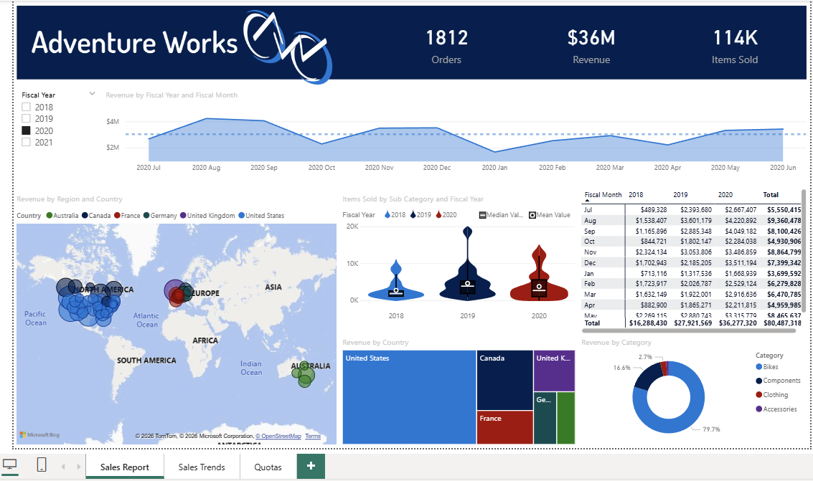

# Sales Performance & Quotas Dashboard (Power BI)

## Overview
This project is a multi-page Power BI business intelligence dashboard designed to analyze company sales performance, revenue trends, and quota attainment.

The report enables stakeholders to track KPIs, monitor month-over-month changes, and evaluate staff performance against targets through interactive visuals and drilldowns.

It demonstrates end-to-end BI workflow including data modeling, Power Query transformations, and DAX calculations.

---

## Dashboard Pages

### Sales Overview
- Revenue KPIs
- Orders and items sold
- Monthly trends
- Revenue by region (map)
- Revenue by product category

### Sales Trends
- Month-over-month revenue waterfall
- Variance analysis
- Trend table with growth %

### Quotas
- Staff revenue vs quota comparison
- Variance tracking
- Performance monitoring

---

## Skills Demonstrated
- Power BI data modeling (relationships/star schema)
- Power Query (ETL & transformations)
- DAX measures and KPIs
- Dashboard design
- Business reporting
- Visual storytelling
- Interactive filtering and slicers

---

## Files
- Sales_Report.pbix
- Sample datas (Excel/CSV)

---

## Tools
- Power BI Desktop
- Power Query (M)
- DAX

---

## Dashboard Preview

---

